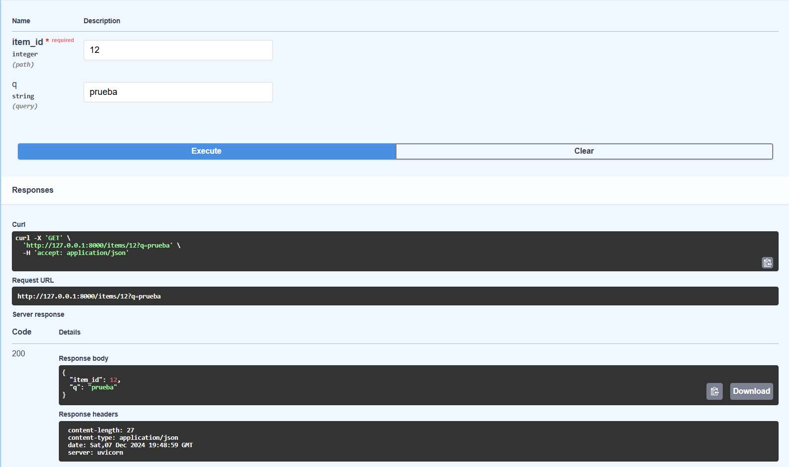
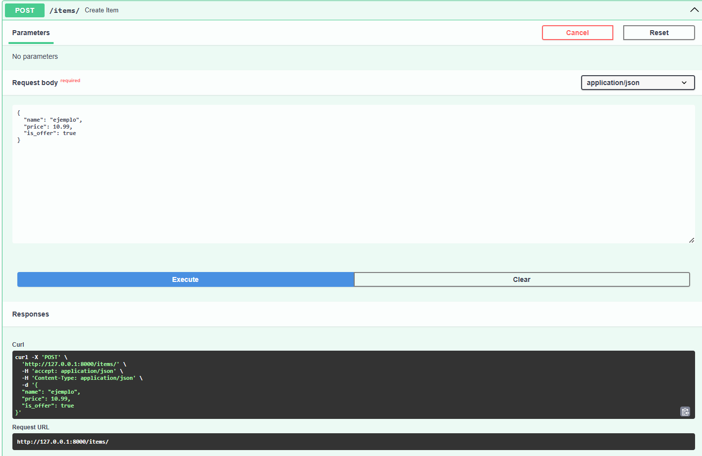
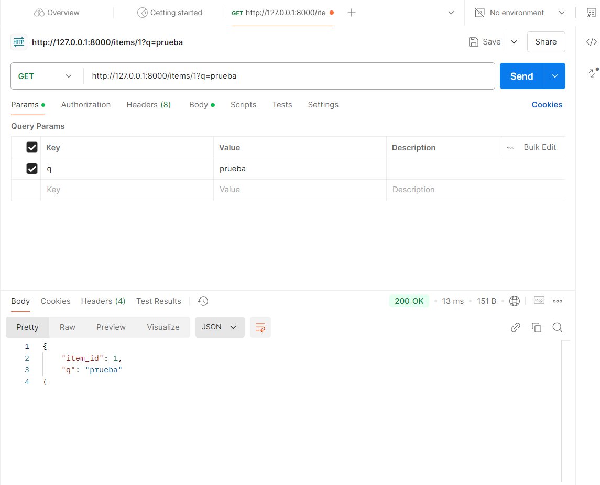
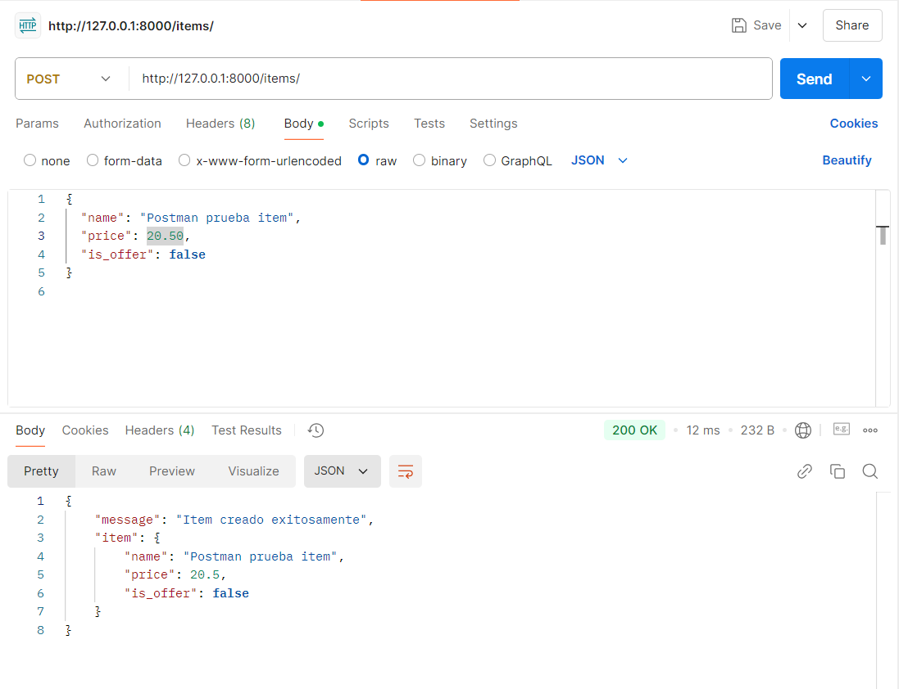
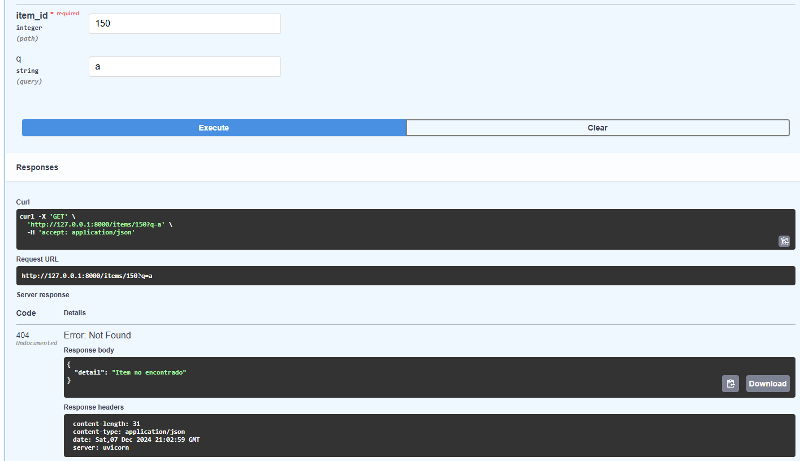
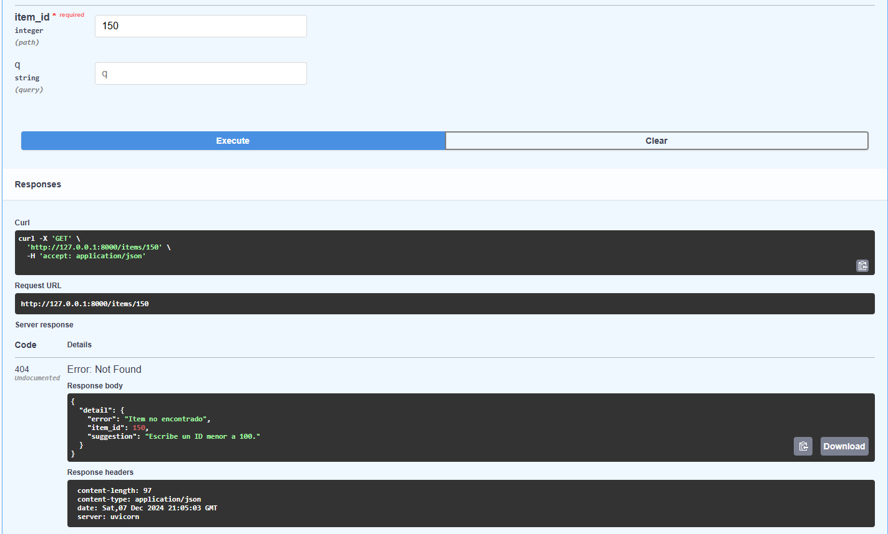

# UF2_FASTAPI
Prueba de los endpoints funcionando correctamente. 
GET:

POST:

Prueba con POSTMAN. 
GET:

POST:

Captura de error 404. 
Primera modificación:

Segunda modificación (último ejercicio):

